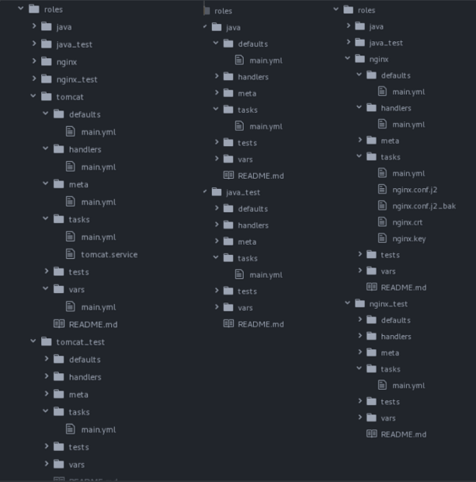

###### MTN.NIX Automated Environment Configuration Management  
## Ansible. 2 
##### Student: Zakhar Virinsky


##### Lab Work Task. Web Server Provisioning
##### Review:  
Using Ansible v2.3.1 for provisioning nginx + tomcat application stack.
Learning by doing.
##### Task
On Host Node (Control Machine):
  *  Create folder ~/cm/ansible/day-2. All working files are supposed to be placed right there.
  *  Spin up clear CentOS7 VM using vagrant (repo with vagrantfile). Verify connectivity to the host using ssh keys (user: vagrant)
  *  Create ansible inventory file (name: inventory) with remote host connection details:
Remote VM hostname/ip/port
Remote ssh log in username
Connection type
  *  Develop a playbook (name: site.yml) which is supposed to run against any host (specified in inventory)  
    -  Develop roles:
java (installs java)
java_test (does only checks that java installed and running properly)
tomcat (installs tomcat)
tomcat_test (does only checks that tomcat installed and running properly)
nginx (installs nginx)
nginx_test (does only checks that nginx installed and running properly)  
    - Playbook should consist of 2 Plays:  
      - Installation
      - Verification  

    - Use handlers to manage tomcat/nginx configuration changes  
    - Use module debug to check configuration during the installation  
    - Define play/roles variables (at least):
      - tomcat_version
      - tomcat_home
      - tomcat_user
      - tomcat_group
      - java_version   

    - Every task/handler should have a name section with details of task purpose.

  * Software installation requirements:
Tomcat AS should be installed from sources (tar.gz) – download from the official site (http://archive.apache.org/dist/tomcat/).
Tomcat AS should be owned (and run) by user specified in variable (default: tomcat_as:tomcat_as_group).
Tomcat AS version should be 7.x, 8.x (at least 5 versions), exact version to be installed is taken from appropriate variable.
Tomcat installation folder (CATALINA_HOME) is /opt/tomcat/$version, where $version is the version of tomcat defined in playbook.
Java can be installed from CentOS Repositories
Use module yum to install Nginx
Use module template for management of nginx cofigs
Tomcat home page should be available on port 80 (accessible from Control Machile) via nginx.
  * Verification Procedure: playbook will be checked by instructor’s CI system as follows:
   - Connect to student’s host by ssh (username “student”) with own ssh key.
   - Go into the folder mentioned in point 1
   - Destroy/Launch VM: vagrant destroy && vagrant up
   - Execute VM provisioning: ansible-playbook site.yml -i inventory -vv
   - If previous steps are done successfully, instructor will check report (pdf-file)  

  * Feedback: report issues/problems you had during the development of playbook and time spent for development.


## Report notes

##### Directories structure:


##### site.yml:

```yaml
- name: Installation
  hosts: pets
  become: true
  become_method: sudo

  roles:
  - role: tomcat
  - role: nginx
##########################

- name: Verification
  hosts: pets
  become: true
  become_method: sudo

  roles:
  - role: java_test
  - role: nginx_test
  - role: tomcat_test

#########################

- name: Check from localhost
  hosts: localhost

  tasks:
    - name: check if it possible to connet to tomcat (GET)
      uri:
        url: http://localhost:8080

    - action: uri url=http://localhost:8080 return_content=yes
      register: webpage

    - fail: msg="It's not tomcat!"
      when: "'Tomcat' not in webpage.content"
```

##### inventory:
```
[pets]
pet ansible_ssh_host=192.168.56.10

[pets:vars]
ansible_ssh_port=22
ansible_ssh_user = vagrant
ansible_ssh_private_key_file = .vagrant/machines/default/virtualbox/private_key
```
##### ansible.cfg:
```
[defaults]
hostfile = inventory
host_key_checking = False
deprecation_warnings=False
```
#### java role files:  
##### task/main.yml:
```yaml
---
- name: Install java
  yum:
    name: java-{{ java_version }}-openjdk-devel
    state: installed
```
##### defaults/main.yml:
```yaml
---
java_version: 1.8.0
```
#### tomcat role files:  
##### defaults/main.yml:  
```yaml
---
tomcat_version: 8
tomcat_subversion: 5.9
```
##### handlers/main.yml:
```yaml
---
- name: restart tomcat
  service: name=tomcat state=restarted
```
##### meta/main.yml(part):
```yaml

dependencies:
  - role: java
```
##### tasks/main.yml:
```yaml
---
- name: Check for tomcat_as_group, create if doesn't exist
  group:
    name: tomcat_as_group
    state: present

- name: Create user tomcat_as
  user:
    name: tomcat_as
    group: tomcat_as_group
    state: present
    createhome: no

- name: Download tomcat sources
  unarchive:
    src: http://archive.apache.org/dist/tomcat/tomcat-{{ tomcat_version }}/v{{ tomcat_full_version }}/bin/apache-tomcat-{{ tomcat_full_version }}.tar.gz
    dest: /tmp
    remote_src: True
    creates: /tmp/apache-tomcat-{{ tomcat_full_version }}

- name: create directory for tomcat
  file:
    path: "{{ tomcat_home }}"
    state: directory

- name: copy tomcat files to catalina home
  shell:
    cp -r -n /tmp/apache-tomcat-{{ tomcat_full_version }}/* /opt/tomcat/{{ tomcat_full_version }}
  args:
    creates: /opt/tomcat/{{ tomcat_full_version }}/bin

- name: Change permissions
  file:
    path: /opt/tomcat
    state: directory
    recurse: yes
    owner: tomcat_as
    group: tomcat_as_group
    mode: 0744

- name: replace tomcat.service with aproriate
  template:
    src: ./tomcat.service
    dest: /etc/systemd/system
    owner: tomcat_as
    group: tomcat_as_group
    mode: 0744
  notify: restart tomcat

- name: enable and start tomcat service if necessary
  systemd:
    name: tomcat
    state: started
    enabled: yes
```
##### tasks/tomcat.service:
```
[Unit]
Description=Apache Tomcat Web Application Container
After=syslog.target network.target

[Service]
Type=forking

Environment=CATALINA_PID={{ tomcat_home}}/temp/tomcat.pid
Environment=CATALINA_HOME={{ tomcat_home}}
Environment=CATALINE_BASE={{ tomcat_home}}

ExecStart={{ tomcat_home}}/bin/startup.sh
ExecStop=/bin/kill -15 $MAINPID

User=tomcat_as
Group=tomcat_as_group

[Install]
WantedBy=multi-user.target
```
##### vars/main.yml:
```yml
tomcat_full_version: "{{ tomcat_version }}.{{ tomcat_subversion }}"
tomcat_home: /opt/tomcat/{{ tomcat_full_version }}
```
### nginx role files:
##### defaults/main.yml
```yaml
key_file: /etc/nginx/ssl/nginx.key
cert_file: /etc/nginx/ssl/nginx.crt
```
##### handlers/main.yml
```yaml
- name: restart nginx
  service: name=nginx state=restarted
```
##### tasks/main.yml
```yaml
- name: Install NGINX
  yum:
    name: nginx
    state: installed

- name: replace nginx.conf with aproriate
  template:
    src: ./nginx.conf.j2
    dest: /etc/nginx/nginx.conf
    owner: nginx
    group: nginx
    mode: 0744
  notify: restart nginx

- name: enable and start nginx service
  systemd:
    name: nginx
    state: started
    enabled: yes
    daemon-reload: yes
```
##### tasks/nginx.conf.j2:
```
worker_processes 1;

events { worker_connections 1024; }

http {

    sendfile on;

    server {
      listen 80 default_server;

      server_name localhost 192.168.56.10;
      location / {
          proxy_pass http://localhost:8080;
      }
  }

}
```
### java_test role files:
##### tasks/main.yml
```yaml
- name: Check java version
  shell:
    java -version
  register: java_info

- debug: var=java_info.stderr_lines
```

### nginx_test role files:
##### tasks/main.yml
```yaml
- name: Check NGINX state
  systemd:
    name: nginx
  register: nginx_state

- debug: var=nginx_state.status.ActiveState

- name: Check NGINX process
  shell:
    ps -ef | grep nginx
  register: nginx_process

- debug: var=nginx_process

- name: Assert nginx service status
  shell: systemctl status nginx
  register: n_cmd_result

- assert:
    that:
      - "'dead' not in n_cmd_result.stderr"

```

### tomcat_test role files:
##### tasks/main.yml
```yaml
- name: Check tomcat state
  systemd:
    name: tomcat
  register: tomcat_state

- debug: var=tomcat_state.status.ActiveState

- name: Check if nginx redirects, tomcat page returns 200
  uri:
    url: http://{{ansible_enp0s8.ipv4.address}}
    return_content: yes
  register: webpage

- name: Check if it is actually tomcat's page
  fail:
  when: "'Tomcat' not in webpage.content"

- name: Check tomcat process
  shell:
    ps -ef | grep tomcat
  register: tomcat_process

- debug: var=tomcat_process

- name: Assert tomcat service status
  shell: systemctl status tomcat
  register: t_cmd_result

- assert:
     that:
       - "'dead' not in t_cmd_result.stderr"
```
