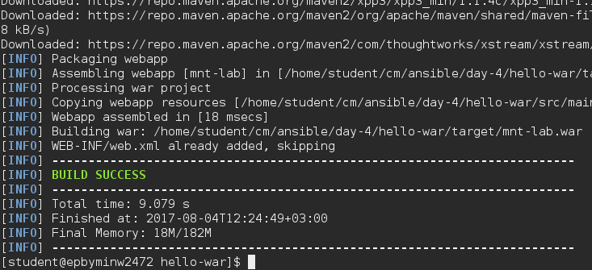

###### MTN.NIX Automated Environment Configuration Management  
## Ansible. 4 
##### Student: Zakhar Virinsky

##### Lab Work Task. Web Server Provisioning
##### Review:  
Using Ansible v2.3.1 for provisioning nginx + tomcat application stack.   
Learning by doing.  

##### Task
On Host Node (Control Machine):
  * Create folder ~/cm/ansible/day-4. All working files are supposed to be placed right there.
  * Configure Ansible to use roles from ~/cm/ansible/day-3 folder
  * Build java sources with maven form here: https://github.com/sbeliakou/hello-war (MANUALLY)  
Requirements:  
    Update file src/main/resources/build-info.txt with following details:
    - Build time
    - Build Machine Name
    - Build User Name  
      - Build command:   
$ mvn clean package -DbuildNumber=$VERSION  

  * Develop a module for deploying resulted war file to Tomcat AS.  
Example:
    - deploy: url=... war=… username=… password=…

Requirements:  
  After deployment you should update file /var/lib/tomcat/webapps/deploy-info.txt  
  Add following details:   
    deployment time  
     deploy User  

  * Develop a playbook (name: deploy.yml) to deploy war file (role!), pass war-file as an extra-argument to playbook.
Example:
$ ansible-playbook deploy.yml … -e war=…

##### Consider:  
 Playbook should deploy war file and test that deployment was successful.

  * Develop custom callback plugin to make playbook output more human readable.
Example: Appendix A.
  * Verification Procedure: playbook will be checked by instructor’s CI system as follows:
    - Connect to student’s host by ssh (username “student”) with own ssh key.
    - Go into the folder mentioned in point 1
    - Destroy/Launch VM: vagrant destroy && vagrant up
    - Execute VM provisioning: ansible-playbook deploy.yml -i inventory -vv
    - If previous steps are done successfully, instructor will check report (pdf-file)
  * Feedback: report issues/problems you had during the development of playbook and time spent for development.


## Report notes

##### src/main/resources/build-info.txt:
```
Build_time=12:23
Build_machine_name=epbyminw2472.minsk.epam.com
Build_user_name=student
```
##### $ mvn clean package -DbuildNumber=$VERSION


##### library/deploy.sh:
```
#!/bin/bash
source $1

if [ -z "$url" ] || [ -z "$war" ] || [ -z "$username" ] || [ -z "$password" ] ; then
    echo "Missed parameter... exit..."
    exit 0
fi
if [ ! -f $war ]; then
    echo "deploy file is missing... exit..."
    exit 0
fi
filename=$(basename "$war")
url_end="${filename%.*}"

out=$(curl -u $username:$password --upload-file $war "$url/manager/text/deploy?path=/$url_end&update=true")

echo $out | grep OK > /dev/null
if [ $? == 0 ]; then
    status="ok"
    changed="true"
else
    status="failed"
    changed="false"
    exit 0
fi
d_time=$(date)

printf '{"changed": "%s", "status": "%s", "date": "%s", "username": "%s", "app": "%s"}' "$changed" "$status" "$d_time" "$username" "$url_end"
```
##### deploy.yml:
```yaml
- name: Installation
  hosts: pets
  become: true
  become_method: sudo

  roles:
  - role: tomcat
  - role: nginx

  tasks:
  - set_fact:
      tomcat_home: "{{ tomcat_home }}"

- name: Deploying
  hosts: pets
  become: true
  become_method: sudo

  roles:
  - role: deploy_war
```
##### ansible.cfg:
```
[defaults]
hostfile = inventory
host_key_checking = False
deprecation_warnings=False
roles_path = /home/student/cm/ansible/day-3/roles
callback_whitelist = jabber
```
##### inventory:
```
[pets]
pet ansible_ssh_host=192.168.56.10

[pets:vars]
ansible_ssh_port=22
ansible_ssh_user = vagrant
ansible_ssh_private_key_file = .vagrant/machines/default/virtualbox/private_key
```
### deploy_war role
##### defaults/main.yml:
```yaml
---
username: admin
password: admin
url: http://192.168.56.10:8080
```
##### files/cpntext.xml:
```xml
<?xml version="1.0" encoding="UTF-8"?>

<Context antiResourceLocking="false" privileged="true" >
  <Valve className="org.apache.catalina.valves.RemoteAddrValve"
         allow="127\.\d+\.\d+\.\d+|::1|0:0:0:0:0:0:0:1|192\.168\.56\.\d+" />
</Context>
```
##### files/deploy-info.txt:
```
deployed at:
{{ script_out.date }}
deployed by:
{{ script_out.username }}
```
##### files/tomcat-users.xml:
```xml
<?xml version="1.0" encoding="UTF-8"?>

<tomcat-users xmlns="http://tomcat.apache.org/xml"
              xmlns:xsi="http://www.w3.org/2001/XMLSchema-instance"
              xsi:schemaLocation="http://tomcat.apache.org/xml tomcat-users.xsd"
              version="1.0">

<role rolename="admin"/>
<role rolename="admin-gui"/>
<role rolename="manager-script"/>
<role rolename="manager-gui"/>
<user username="admin" password="admin" roles="admin,admin-gui,manager-script,manager-gui"/>
<user username="manager" password="manager" roles="manager-gui"/>

</tomcat-users>
```
##### handlers/main.yml:
```yaml
---
- name: restart tomcat
  service: name=tomcat state=restarted
```
##### tasks/main.yml:
```yaml
---
- name: replace tomcat-users.xml with aproriate one
  template:
    src: ../files/tomcat-users.xml
    dest: '{{ tomcat_home }}/conf/'
    owner: tomcat_as
    group: tomcat_as_group
    mode: 0744
  notify: restart tomcat


- name: replace context.xml with aproriate one
  template:
    src: ../files/context.xml
    dest: '{{ tomcat_home }}/webapps/manager/META-INF/'
    owner: tomcat_as
    group: tomcat_as_group
    mode: 0744
  notify: restart tomcat

- name: force handlers
  meta: flush_handlers

- pause:
    minutes: 1
    prompt: "wait for tomcat starts"  

- name: execute deploy script
  deploy:
    url: "{{ url }}"
    war: "{{ war }}"
    username: "{{ username }}"
    password: "{{ password }}"
  delegate_to: localhost
  register: script_out


- name: create directory for deploy-info.txt
  file:
    path: /var/lib/tomcat/webapps
    state: directory
    recurse: yes
    owner: tomcat_as
    group: tomcat_as_group
    mode: 0744

- name: copy deploy-info.txt to remote host
  template:
    src: ../files/deploy-info.txt
    dest: /var/lib/tomcat/webapps/
    owner: tomcat_as
    group: tomcat_as_group
    mode: 0744

- name: Check if nginx redirects, tomcat page returns 200
  uri:
    url: "{{ url }}/{{ script_out.app }}"
    assert:
  register: webpage

- assert:
    that:
      - "{{ webpage.status }} == 200"
```


##### callback plugin:
```yaml
from __future__ import (absolute_import, division, print_function)
__metaclass__ = type

import collections
import os
import time

from ansible.module_utils.six.moves import reduce
from ansible.plugins.callback import CallbackBase


# define start time
t0 = tn = time.time()


def secondsToStr(t):

    def rediv(ll, b):
        return list(divmod(ll[0], b)) + ll[1:]

    return "%d:%02d:%02d.%03d" % tuple(reduce(rediv, [[t * 1000, ], 1000, 60, 60]))

def filled(msg, fchar="="):
    if len(msg) == 0:
        width = 79
    else:
        msg = "%s " % msg
        width = 79 - len(msg)
    if width < 3:
        width = 3
    filler = fchar * width
    return "%s%s " % (msg, filler)


def timestamp(self):
    if self.current is not None:
        self.stats[self.current]['time'] = time.time() - self.stats[self.current]['time']

def tasktime():
    global tn
    time_current = time.strftime('%A %d %B %Y  %H:%M:%S %z')
    time_elapsed = secondsToStr(time.time() - tn)
    time_total_elapsed = secondsToStr(time.time() - t0)
    tn = time.time()
    return filled('%s (%s)%s%s' % (time_current, time_elapsed, ' ' * 7, time_total_elapsed))


class CallbackModule(CallbackBase):

    CALLBACK_VERSION = 2.0
    CALLBACK_TYPE = 'aggregate'
    CALLBACK_NAME = 'profile_tasks'
    CALLBACK_NEEDS_WHITELIST = True

    def __init__(self):
#        super(CallbackModule, self).__init__(*args, **kwargs)
        self.stats = collections.OrderedDict()
        self.current = None
        self.sort_order = os.getenv('PROFILE_TASKS_SORT_ORDER', True)
        self.task_output_limit = os.getenv('PROFILE_TASKS_TASK_OUTPUT_LIMIT', 20)
        self.task = None
        self.play = None

        if self.sort_order == 'ascending':
            self.sort_order = False

        if self.task_output_limit == 'all':
            self.task_output_limit = None
        else:
            self.task_output_limit = int(self.task_output_limit)

        super(CallbackModule, self).__init__()

    def _record_task(self, task):
        """
        Logs the start of each task
        """
        self._display.display(tasktime())
        timestamp(self)

        # Record the start time of the current task
        self.current = task._uuid
        self.stats[self.current] = {'time': time.time(), 'name': task.get_name()}
        if self._display.verbosity >= 2:
            self.stats[self.current]['path'] = task.get_path()

    def v2_playbook_on_task_start(self, task, is_conditional):
        self._record_task(task)

    def v2_on_any(self, *args, **kwargs):
#         self._display.display("--- play: {} task: {} ---".format(getattr(self.play, 'name', None), self.task))

         self._display.display("="*120)
         for i, a in enumerate(args):
             self._display.display('   %s  <%s> %s' % (" "*32,a, " "*32))

#         self._display.display("      --- KWARGS ")
#         for k in kwargs:
#             self._display.display('     %s: %s' % (k, kwargs[k]))

    def v2_playbook_on_handler_task_start(self, task):
        self._record_task(task)

    def playbook_on_setup(self):
        self._display.display(tasktime())

    def playbook_on_stats(self, stats):
        self._display.display(tasktime())
        self._display.display(filled("", fchar="="))

        timestamp(self)

        results = self.stats.items()

        # Sort the tasks by the specified sort
        if self.sort_order != 'none':
            results = sorted(
                self.stats.items(),
                key=lambda x: x[1]['time'],
                reverse=self.sort_order,
            )
```
